- **2025-12-20 05:55** 我知道了 为什么faddeev方程在重靶的难点. 因为库仑相互作用更难屏蔽. 或者采用库仑扭曲波函数作为基底, 但这样不同二体的基底变换会变得十分复杂. 


CSB 方法的原理
CSB 方法放弃了平面波基底

文献如下: 

https://journals.aps.org/prc/abstract/10.1103/PhysRevC.86.034001

引文网络 [三体 Citation Tree](<库仑扭曲波函数Citation Tree.html>)

https://journals.aps.org/prc/pdf/10.1103/PhysRevC.55.1080

光学势的构造 https://journals.aps.org/prc/abstract/10.1103/PhysRevC.88.064608


(

https://people.ohio.edu/elster/research/1809.06351.pdf )

似乎算束缚态的
https://juliafewbody.github.io/FewBodyDB.jl/stable/#Usage


Deltuva 的代码找不到


faddeev 方程 and alt-grassberger-sandhas (AGS) equations 的文献


L.D. Faddeev, Rigorous three-particle scattering problem. Zh. Eksp. Teor. Fiz. 39, 1459 (1960). ([Sov. Phys. JETP 12, 1014
(1961)])

 E.O. Alt, P. Grassberger, W. Sandhas, Reduction of the three-particle collision problem to multi-channel two-particle
Lippmann-Schwinger equations. Nucl. Phys. B 2, 167 (1967)  

- **2025-12-20 07:56** 这群人就不写细节的吗? https://www.researchgate.net/publication/396693052_Faddeev-type_calculation_of_nonelastic_breakup_in_deuteron-nucleus_scattering

- **2025-12-21 10:35** 引文网络'https://www.connectedpapers.com/main/68fdb5779356e4ba8c3f848caf39b6edd235cf01/graph?utm_source=share_popup&utm_medium=copy_link&utm_campaign=share_graph'

- **2025-12-21 10:54** https://journals.aps.org/prc/abstract/10.1103/PhysRevC.88.011601

- **2025-12-21 10:55** deltuva 确实是faddeev方程专家 但是他的论文写得都不是很详细. 

- **2025-12-22 09:19** A similar role  is contributed nowadays to the three-nucleon system as a testing ground far  nuclear dynamics and maybe in the near future to few-quark systems.  -- walter Glockle in his The quantum mechanical few body problem

- **2025-12-22 09:20** 方法,核心自由度,理论基础,适用场景,量子力学成分
格点 QCD,夸克、胶子场,第一性原理 (离散化QCD),所有强相互作用，但计算极昂贵,低 (路径积分)
组分夸克模型,组分夸克,薛定谔方程 + 有效势,强子能谱、多夸克态结构,极高
QCD 求和规则,夸克流算符,OPE + 色散关系,估算基态质量,无 (解析推导)有效场论 (EFT),强子 / 重夸克,对称性 (手征/重夸克),强子分子态、低能散射,中 (场论框架)

- **2025-12-22 09:21** 组分夸克模型 用的是量子力学的方法  有些会用faddeev方程计算四夸克

- **2025-12-22 09:46** Modern Theory of Nuclear Forces https://journals.aps.org/rmp/pdf/10.1103/RevModPhys.81.1773 现代观点的核力来源

- **2025-12-22 09:49** sekiguchi 和 deltuva 有合作 https://www.researchgate.net/publication/397211838_Analyzing_powers_for_proton-_He_3_elastic_scattering_at_intermediate_energies

- **2025-12-22 09:56**  Method of Screened Coulomb with Renormalization)。思路：人为把库仑势屏蔽掉（乘以一个 ^{-(r/R)^n}$），在这个屏蔽势下求解 AGS 方程，然后通过特定的数学操作取  	o \infty$ 的极限，恢复物理的散射振幅。

- **2025-12-22 10:44** Mathematical scattering theory : general theory
I͡Afaev, D. R. (Dmitriĭ Rauelʹevich),  这本书似乎是我没法看懂的数学 不会测度论 和 泛函

- **2025-12-22 10:58** Scattering theory is, roughly speaking, perturbation theory of self-adjoint operators on the (absolutely) continuous spectrum.
-


谱分解 (Spectral Decomposition)

数学版： $H = \int \lambda dE(\lambda)$。

物理版： 完备性关系（Completeness Relation）。$$\mathbb{1} = \sum_n |\psi_n\rangle\langle\psi_n| + \int dE |\psi_E\rangle\langle\psi_E|$$

第一项是离散谱（点谱），对应束缚态；第二项是连续谱，对应散射态。

做散射理论的核心就是处理那个积分部分。


Resolvent (预解算子 / 格林函数算子) 


$$G(z) = \frac{1}{z - H}$$

物理意义： 这就是能量表象下的格林函数。

为什么重要： 散射截面（Cross section）和 T-matrix 都可以从 $G(z)$ 在实轴附近的极限 $G(E + i\epsilon)$ 得到。

极点： $G(z)$ 
在复平面上的极点（Poles）位置直接对应物理态：负实轴极点 = 束缚态。

非物理叶（Second Riemann sheet）上的极点 = 共振态。


算子是否紧 (Compactness)

为什么要关心这个？ 因为我们通常解积分方程（如 Lippmann-Schwinger 方程）$|\psi\rangle = |\phi\rangle + G_0 V |\psi\rangle$。

物理直觉： “紧算子”你可以理解为“在这个相互作用下，记忆是有限的”或者“矩阵是可以被有效截断的”。

如果积分核 $K = G_0 V$ 是紧算子（或者其幂次是紧的），那么 Fredholm 理论告诉我们这个方程有唯一解（或者可以通过矩阵求逆数值求解）。

Faddeev 的痛点： 在三体问题中，两体相互作用 $V_{12}$ 甚至不是连通的（它包含了一个不受力的第三个粒子），导致积分核不是紧算子（Non-compact）。这意味着标准的散射方程数值上发散，解不出来。Faddeev 的伟大之处就在于他把方程改写了一下，使得新的积分核变回了“紧算子”，从而可以求解。


taloyor 那本散射理论 才是我该看的书. 以及Glockle 的 少体来学习faddeev方程. 

```
Ludwig Faddeev (1934-2017)
├─ 导师：Olga Ladyzhenskaya
├─ 主要学生：
│  ├─ Victor Popov (Faddeev-Popov ghost)
│  ├─ Petr Kulish (1980 PhD) → 量子群先驱
│  ├─ Irina Arefyeva → 量子场论
│  ├─ Leon Takhtajan → 量子逆散射方法
│  ├─ Evgeny Sklyanin (1980 PhD) → 量子群、可积系统
│  ├─ Nicolai Reshetikhin → 量子群理论奠基人
│  ├─ Vladimir Korepin → 量子逆散射方法
│  └─ Michael Semenov-Tian-Shansky → 可积系统
└─ 学术影响：量子三体问题、量子群理论、量子逆散射方法

Arnoldas Deltuva (1976-)
├─ PhD导师：Peter U. Sauer (Hannover, 2003)
├─ 合作导师：António C. Fonseca (Lisboa)
├─ 研究领域：三体少体问题的动量空间方法
├─ 当前职位：Vilnius University 首席研究员
└─ 学生：在维尔纽斯大学指导博士生

三体问题其他重要派系：
├─ Sergey Merkuriev → Faddeev-Merkuriev方程
├─ Alt-Grassberger-Sandhas → AGS方程
├─ Walter Glöckle (Bochum) → Faddeev-Yakubovsky方程
├─ Pisa组 (意大利) → 坐标空间方法
├─ Grenoble-Strasbourg组 (法国) → 坐标空间方法
└─ 日本组 → 有限范围展开方法
```

- **2025-12-23 11:38** https://ntse.khb.ru/files/uploads/2014/presentations/ElsterC.pdf 这里面有关于库仑扭曲基底下的三体faddeev实现过程, 至少是框架. 可能只算了t矩阵

- **2025-12-23 11:40**  https://www.osti.gov/servlets/purl/1471708 这里面这个作者Mukhamedzhanov 恐怕是库仑波函数玩得最六的

- **2025-12-23 11:44**  https://www.connectedpapers.com/main/876d78c49a310cc50ef7419c764280bbf475b925/Three%20body-Faddeev-equations-in-two%20particle-Alt%20Grassberger%20Sandhas-form-with-distorted%20wave%20Born%20approximation-amplitudes-as-effective-potentials/graph  所以找了这个作者的文章cite tree 虽然感觉这个cite tree里面并不是以库仑扭曲波为主要内容的. 依然很多都是用的屏蔽的方法


- **2025-12-24 11:12**  'https://arxiv.org/pdf/1508.05061 '  文章在 Upadhyay 等人 2014 PRC 90, 014615 提出的正则化方案基础上，提出了一个改进的 Gel’fand–Shilov 正则化. 文章在 Upadhyay 等人 2014 PRC 90, 014615 提出的正则化方案基础上，提出了一个改进的 Gel’fand–Shilov 正则化

- **2025-12-24 11:13**  https://www.connectedpapers.com/main/876d78c49a310cc50ef7419c764280bbf475b925/Three%20body-Faddeev-equations-in-two%20particle-Alt%20Grassberger%20Sandhas-form-with-distorted%20wave%20Born%20approximation-amplitudes-as-effective-potentials/graph mukhamedzhanov 的一个引文网络. 

- **2025-12-24 11:15**  https://people.ohio.edu/elster/lectures/fewblect_3.pdf 这个人是那个slides的作者 他教授的nuclear theory 似乎还不错. 

- **2025-12-24 11:17** github上这个库 也是 https://github.com/paolofinelli/Theoretical-and-Numerical-Nuclear-Physics-Course/blob/master/Faddeev/3Body_system_readme.md  也是参考 Elster 和 Glocke的资料的


Elster 和 Glöckle 都属于“核少体/费米子多体散射”这一学派，强调从现实核力出发，用 Faddeev 类型方程严格求解三体（3N）束缚态和散射问题，并在后期与相对论形式化和手征有效场论（EFT）结合。[1][2]

## Walter Glöckle 的学术谱系与学派

- 学术出身与早期导师  
  - 1964 年在斯图加特大学完成物理学学习，之后在海德堡大学理论物理研究所攻读博士，1965 年以多道散射 S 矩阵解析性质的论文获得博士学位，其导师圈属于当时德国核理论/散射理论传统（文献未点名具体导师，但系别和方向与核反应与壳模型有关）。[2]
  - 1968–1970 年在法国 Saclay 的核研究中心做访问科学家，从事三体问题的新处理方法，这一时期受到法国 few‑body 社群（三体散射）方法的影响。[2]

- 他建立的“Bochum 三体/Faddeev 学派”  
  - 1972 年在海德堡取得关于“量子三体问题新处理”的教授资格后，立即被聘为波鸿鲁尔大学理论物理教授，并在那里建立了以三核子 Faddeev 方程为核心的研究小组，这个小组后来成为全球少体核物理的重要中心之一。[2]
  - 他和 H. Witała 首先给出了采用现实 NN 势（如 Bonn 型等）求解三核子连续态 Faddeev 方程的数值算法，系统研究三核子束缚态和核子‑氘散射（含三体力）等问题，形成了一个强调“高精度数值+现实核力”的 **few‑body** 传统。[3][2]

- 典型合作者与“学术后代”（学生/合作者圈）  
  - 长期核心合作者包括：H. Witała、J. Golak、D. Hüber、H. Kamada、A. Nogga、R. Skibiński、Th. Cornelius 等，许多人在克拉科夫（Jagiellonian）、波鸿、波恩等地形成各自的少体核理论小组，可视为他的“学术后代网络”。[4][2]
  - 在超核物理、四体以上系统和电磁反应中，他与 K. Miyagawa、T. Mart、C. Bennhold、B. Barrett 等合作，这些团队延续了他在少体积分方程和三体力处理方面的技术路线。[2]

- 与其他学派的交叉（相对论与手征 EFT）  
  - 在相对论 few‑body 方面，他与 F. Coester、W. N. Polyzou、H. Kamada 等合作，发展 Poincaré 不变的少体量子论和相对论三核子散射，可看作把传统 Faddeev 学派与美国的 relativistic quantum mechanics 学派连接起来。[5][2]
  - 1990 年代末后，他与 E. Epelbaum、U.-G. Meißner 合作，将手征有效场论的二核子和三核子力系统地并入 Faddeev 计算，对确立“手征 EFT + few‑body 精确数值”这一新框架起到关键作用，这一方向现在在波恩、波鸿、基尔等地都有传承。[6][2]

- 学生与教育影响  
  - 在鲁尔大学三十多年间，他指导了大量博士和博士后，Physics Today 的讣告中特别强调他在量子论课程和著作《The Quantum Mechanical Few‑Body Problem》中的教学影响，这本书本身也培养了世界范围的一代少体物理学者，可视为“广义学生”。[2]

## Christian (Charlotte) Elster 的学术谱系与学派

- 学术方向与“Bonn–Bochum–Ohio” 线路  
  - Elster 出道时参与 Bonn 介子交换 NN 势的构建，与 R. Machleidt、K. Holinde 合作，代表作是 Physics Reports 的“Bonn meson‑exchange model for the NN interaction”，属于德国 Bonn 核力学派的直接传人之一。[1]
  - 随后在核‑核子散射和光学势方面开展工作，强调从现实 NN 势和核结构计算出发构造折叠光学势，这是将 Bonn‑型核力与反应理论相结合的一条 **few‑body/反应理论** 路线。[1]

- 与 Glöckle 学派的交汇  
  - 1990 年代中期起，她与 W. Glöckle、H. Kamada 等紧密合作，发表了关于三核子束缚态、三体散射以及不使用角动量分解的三体 Faddeev 解法等系列论文，形成了“Bochum–Athens (Ohio) Faddeev” 联合学派。[5][1]
  - 她参与发展三维形式的两核子、三核子散射（不做部分波展开）、三体力在 Faddeev 计算中的数值实现，以及三体问题在相对论 Poincaré 不变框架中的处理，因此在方法论上被视为 Glöckle 学派最重要的承接者之一。[1][2]

- 现阶段学术圈与“学生”层  
  - 在 Ohio University 任教后，她形成了以核反应精确理论为核心的小组，研究内容包括：  
    - 利用 ab initio 结构（如 NCSM）给出的非局域单体密度，构造折叠光学势并进行核子‑核散射计算；  
    - 针对稀有同位素和 (d,p) 反应的 Faddeev‑AGS 描述。  
    这些工作在她的发表列表和多次被邀请的报告中有详细记录。[1]
  - 从最近约十年的论文和会议报告来看，她指导和合作的一批年轻学者包括 R. B. Baker、M. Burrows、L. Hlophe、Jin Lei、G. Popa 等，他们在三体 Faddeev、(d,p) 反应、Coulomb 扰动动量空间处理和 ab initio 折叠势上延续她的技术路线，可视作她的“学术子代”。[1]

- 与国际少体与反应学派的联系  
  - 她与 F. M. Nunes、I. J. Thompson、G. Arbanas、A. Nogga、D. R. Phillips 等合作，使得她的小组在手征 EFT、halo EFT、FRIB 相关反应和多通道光学势等方向上成为连接 few‑body 数值技术、反应理论和实验项目的关键节点。[7][1]
  - 多次在 Few‑Body、NTSE、INT、ECT* 等国际会议上作 invited talk，参与“few‑body 物理的未来”“从束缚态到连续谱”等主题报告，使她在全球 few‑body 社群中被视为 Glöckle 传统的现代代表之一。[1]

## 总结式对比：Glöckle 与 Elster 的学术派系、师承与学生

| 项目 | Walter Glöckle | Christian (Charlotte) Elster |
| --- | --- | --- |
| 学术起点 | 斯图加特本科，海德堡理论物理所核反应/壳模型方向博士。[2] | 德国 Bonn 介子交换核力传统（与 Machleidt、Holinde 合作构建 Bonn NN 势）。[1] |
| 主要学派定位 | 量子少体/Faddeev 三核子学派，Bochum “三体中心”。[2][3] | “Bonn‑Bochum‑Ohio” 路线：现实核力 + 少体反应理论 + ab initio 光学势。[1] |
| 代表性贡献 | 精确求解三核子 Faddeev 方程（含三体力）；《The Quantum‑Mechanical Few‑Body Problem》；三核子连续谱综述等。[2][4] | Bonn NN 势；三维 NN/3N 散射；三体散射与 (d,p) 反应的 Faddeev‑AGS 形式；ab initio 折叠光学势与稀有同位素散射。[1] |
| 典型导师/前辈影响 | 海德堡核理论传统；Saclay 三体散射方法；后来与 Coester 等相对论学派融合。[2][5] | Machleidt、Holinde 代表的 Bonn 核力学派；随后深度融入 Glöckle 三体/Faddeev 学派。[1] |
| 主要学生/合作者网络 | H. Witała、J. Golak、H. Kamada、A. Nogga、R. Skibiński、Th. Cornelius 等，及 Epelbaum、Meißner 等手征 EFT 合作者。[2][4] | R. B. Baker、M. Burrows、L. Hlophe、Jin Lei、G. Popa 等 Ohio 学生/合作者；与 F. Nunes、I. Thompson、A. Nogga、D. Phillips 等国际合作者形成反应‑少体网络。[1][7] |
| 理论延伸方向 | 超核 few‑body、四体以上系统、电磁反应、复杂能量法、Poincaré 不变相对论三体、手征 EFT 三核子力等。[2][6] | 3D Faddeev、Coulomb 动量空间处理、多通道可分光学势、halo EFT 体系的 few‑body 反应、FRIB 相关 (d,p) 反应建模等。[1][7] |

如果需要更细的“学术族谱”（例如博士论文题目、具体每位学生的博士时间和题目），可以针对单个名字逐一查原学校和论文数据库，进一步补充。

[1](https://inspirehep.net/authors/1008204)
[2](https://arxiv.org/pdf/2307.06416.pdf)
[3](https://inspirehep.net/literature/304073)
[4](https://inspirehep.net/literature/1866825)
[5](https://www.osti.gov/servlets/purl/1257842)
[6](https://link.aps.org/doi/10.1103/PhysRevC.66.064001)
[7](https://ui.adsabs.harvard.edu/abs/2012JPhCS.403a2025E/abstract)
[8](https://inspirehep.net/literature/392827)
[9](https://arxiv.org/pdf/nucl-th/0208023.pdf)
[10](https://arxiv.org/abs/nucl-th/0312063)
[11](https://misportal.jlab.org/sti/publications/15233/attachments/8694/Moshe_Friedman_PhD_thesis(1).pdf)
[12](https://physicstoday.aip.org/obituaries/obituary-of-walter-gloeckle-1939-2012)
[13](https://archive.int.washington.edu/talks/WorkShops/int_15_58W/People/Papenbrock_T/Papenbrock.pdf)
[14](https://www.ri.cmu.edu/app/uploads/2024/02/Mohit-Sharma-PhD-Thesis.pdf)
[15](https://www.movementdisorders.org/MDS-Files1/International-Congress/PDFs/Final-Programs/DublinFinal-program.pdf)
[16](https://www2.eecs.berkeley.edu/Pubs/TechRpts/2024/EECS-2024-193.pdf)
[17](https://asset.library.wisc.edu/1711.dl/I4V34CHNWTCBX8D/R/file-7d062.pdf)
[18](https://dr.lib.iastate.edu/bitstreams/6843447e-3a56-4a79-8238-c4f8f1f18e36/download)
[19](https://meetings.aps.org/Meeting/HAW09/Session/CH?showAbstract)
[20](https://inspirehep.net/files/c9aeb075d37a69a937e6347fae9905b8)
[21](https://hyoka.ofc.kyushu-u.ac.jp/html/100018126_en.html)
[22](https://inspirehep.net/authors/1405840)
[23](https://arxiv.org/pdf/2211.06281.pdf)
[24](https://indico.ectstar.eu/event/238/contributions/5805/attachments/3808/5502/Drischler_web.pdf)
[25](https://people.ohio.edu/elster/pdf/publist.pdf)
[26](https://euroethnologie.univie.ac.at/en/department/staff/former-members-of-staff/christian-elster/)
[27](https://javieraparicio.net/2009/09/28/jon-elster/)
[28](https://arxiv.org/abs/2211.06281)
[29](https://www.myheritage.no/names/christian_bernstorff%20matheson)
[30](https://www.cecof.org/members/product-and-company-directory-industrial-furnaces-and-heating-eq/elster-gmbh.html)
[31](https://repository.lsu.edu/cgi/viewcontent.cgi?article=8125&context=physics_astronomy_pubs)
[32](https://www.cambridge.org/core/journals/review-of-international-studies/article/genealogy-as-a-research-tool-in-international-relations/13CCB00DABAB4D27085506B1D4497F68)
[33](https://mmonster.co/new-world/leveling/gear-score?srsltid=AfmBOorB5LcriACNWb_p1aALsYYMYfZE4fjSnb6_FqHJ1tKPsSXD3dSj)
[34](https://scholar.google.com/citations?user=4JbETK4AAAAJ&hl=en)
[35](https://discovery.ucl.ac.uk/10018426/1/PhDThesis.AngieOria.Binders_Version-4March2013(VF).pdf)
[36](https://www.digequal.com/elster/)
[37](https://sk.sagepub.com/book/mono/the-entrepreneurial-self/chpt/1-genealogy-subjectification)
[38](https://jcu.academia.edu/JosefElster)
[39](https://www.facebook.com/groups/tracingthetribe/posts/10156600105090747/)
[40](https://elster.vn)


A. Deltuva 属于“维尔纽斯–里斯本–Bochum”这一核少体/Faddeev‑AGS 数值学派，师承 C. Fonseca 和 A. C. Fonseca 等少体核理论传统，学生主要在维尔纽斯大学的少体核与冷原子方向继续发展三体与四体散射理论。量子少体体系整体上还包含圣彼得堡 Faddeev 数学派、Bochum–Bonn 三核子学派、Pisa/Grenoble 等坐标空间学派，以及日本和冷原子 few‑body 学派。[1][2][3]

## A. Deltuva 的老师和学术脉络

- 学术背景与单位  
  - A. Deltuva 现任立陶宛维尔纽斯大学理论物理与天文研究所首席研究员，研究方向是少体核物理与冷原子散射理论。[2]
  - 他的代表性工作是在动量空间严格解三体和四体 Alt–Grassberger–Sandhas (AGS) 方程，包括带库仑力的 p–d、p–\(^{3}\)He、d–核散射等，是“Faddeev‑AGS + 库仑屏蔽/重整化”路线的代表人物。[4][5][6][1]

- 导师与前辈学派  
  - 从长期合作和综述作者顺序看，他直接承接了 E. E. Sauer 和 A. C. Fonseca 的少体核散射传统；三人常以 “Deltuva–Fonseca–Sauer” 署名撰写三、四体库仑散射综述和计算论文，可视为其“学术父辈”。[1]
  - Sauer–Fonseca 学派的特点是：在动量空间 Faddeev/AGS 方程框架下，对带库仑的三体、四体散射做严格数值求解，并和实验精确对比，用于检验 NN 势、3N 力和光学势模型。[3][1]

## A. Deltuva 的学生与合作圈

- 维尔纽斯三体/四体少体小组  
  - 维尔纽斯大学研究者档案显示，他主持多个关于“少簇核反应：走向多体问题”“三粒子核反应理论研究”的项目，在此框架下指导博士生和博士后，形成一个以三体、四体核反应和冷原子散射为核心的研究组。[2]
  - 近年的合作者包括 D. Jurčiukonis 等立陶宛年轻学者，他们在 d–核散射、微观全局光学势（如 2025 年的 deuteron–nucleus 三体工作）中延续他的 AGS 数值路线，可视为其学术后代。[7][8]

- 国际合作网络  
  - 在三核子和四核子散射中，他与 H. Witała、J. Golak 等 Bochnum 三体学派成员有交叉引用与对照计算；在冷原子 Efimov 物理中，则与冷原子群体（引用其三体散射和 Efimov 三体共振结果）互相影响，形成核–冷原子跨学科的 few‑body 网络。[9][3]

（公开资料通常不会列出每一位博士生姓名，如果需要具体学生清单，通常要查维尔纽斯大学博士论文库或直接查 Deltuva 的 ORCID/简历中“supervision”条目。）[2]

## Deltuva 学派的技术特点

- 主要方法  
  - 使用动量空间 Faddeev/AGS 方程，采用屏蔽库仑 + 重整化方案来处理 p–d、p–\(^{3}\)He 和 d–A 等带库仑三体/四体散射，在高精度下比较实验数据。[6][1]
  - 方法上强调：精确 NN 势、3N 力、非局域光学势的引入，数值上采用部分波展开 + 多维积分方程求解，是“严格 few‑body 数值 + 现实势模型”的代表路线。[7][3][1]

- 研究对象  
  - 核领域：p–d、n–d、d–d、p–\(^{3}\)He 等 3N/4N 体系，以及 d–中重核（如 d–\(^{12}\)C、d–\(^{58}\)Ni 等）散射和击破，用于检验光学势和三体反应模型。[1][7]
  - 冷原子领域：三体冷原子散射和 Efimov 物理，例如 n–\(^{19}\)C 模型中三体共振和关联性质，方法仍然是三体积分方程 + 现实散射长度/势模型。[9]

## 其他主要量子少体学派（三体/四体）

- 圣彼得堡 Faddeev 数学派  
  - 以 L. D. Faddeev 为源头，在 Steklov 数学研究所和圣彼得堡大学发展出严格的三体散射数学理论，包括 Faddeev 方程、Faddeev–Merkuriev 对带库仑体系的推广、以及逆散射和可积系统。[10][11]
  - 这一学派重视数学严密性，影响了核物理、原子物理和冷原子中所有基于 Faddeev/FY 方程的后续工作。[10][3]

- Bochum–Bonn 三核子学派  
  - 代表人物有 W. Glöckle、H. Witała、J. Golak、H. Kamada 等，侧重三核子束缚态和散射、三体力效应、以及手征 EFT 在 few‑body 中的应用，通常在动量空间解 Faddeev 或 AGS 方程。[3][1]
  - 与 Deltuva 学派的区别是：Bochum 组在 3N/4N 体系和手征势上更系统，Deltuva 组则在“带库仑的三/四体散射”和“d–A 反应”上更专精，但二者技术高度相通且频繁互相比较结果。[3][1]

- 坐标空间几何学派（Pisa、Grenoble 等）  
  - Pisa 组、Grenoble–Strasbourg 组等发展了配置空间 Faddeev–Yakubovsky 方程和超球谐波方法，用于 3N–5N 系统的束缚态和散射，强调在配置空间上直接求解多粒子 Schrödinger 方程。[3]
  - 这些方法特别适用于中低能束缚态和简单散射过程，而 Deltuva/Fonseca/Sauer 的动量空间 AGS 则更方便处理多通道和带库仑问题。[1][3]

- 日本核反应 few‑body 学派  
  - 以 K. Ogata 等为代表，发展 CDCC、eikonal 以及与 Faddeev/AGS 比对的 few‑body 反应模型，用于 (d,p)、knockout 等反应；在 RCNP、京大和九大等地有较强的反应理论小组。[12][3]
  - 该学派关注从可行的近似 few‑body 模型出发，为稀有同位素实验提供实用描述，与 Deltuva 那种“完全三体/四体方程”的严密路线形成互补。[12][3]

如果你想更细致地画出“Faddeev → Merkuriev → Fonseca → Deltuva”这一条学术族谱，或者“Bochum–Bonn 组”和“Pisa/Grenoble 组”的代表人名和代表论文，可以指定某一支，我可以按时间顺序帮你列出关键论文和人物。

[1](https://www.annualreviews.org/doi/pdf/10.1146/annurev.nucl.58.110707.171203)
[2](https://www.ff.vu.lt/en/science/researcher-profiles-2/1878-dr-arnoldas-deltuva)
[3](https://www.frontiersin.org/journals/physics/articles/10.3389/fphy.2019.00251/full)
[4](https://arxiv.org/abs/0901.2662)
[5](https://arxiv.org/abs/nucl-th/0703065)
[6](https://link.aps.org/doi/10.1103/PhysRevC.71.054005)
[7](https://arxiv.org/abs/2502.17351)
[8](https://arxiv.org/abs/2502.17351v1)
[9](https://s3.cern.ch/inspire-prod-files-5/58bc2a41432b00682dd79432fc8e8f69)
[10](https://arxiv.org/pdf/2504.10301.pdf)
[11](https://indico.global/event/5543/timetable/?view=standard)
[12](https://www.rcnp.osaka-u.ac.jp/~yoshidak/thesis.pdf)
[13](https://archive.org/details/arxiv-nucl-th0703065)
[14](https://repository.dl.itc.u-tokyo.ac.jp/record/50464/files/A33493.pdf)
[15](https://lpsc-indico.in2p3.fr/event/29/contributions/2939/)
[16](https://inspirehep.net/authors/1032369)
[17](https://link.aps.org/doi/10.1103/PhysRevC.26.2226)
[18](https://www-nh.scphys.kyoto-u.ac.jp/articles/thesis/dron/d-murata.pdf)
[19](https://inspirehep.net/literature/396813)
[20](https://research.chalmers.se/publication/503837/file/503837_Fulltext.pdf)


Mukhamedzhanov 属于“苏联/俄罗斯核与少体散射传统 + 德州 A&M 核天体物理”这一学派核心人物之一，上承 Blokhintsev 等苏联核理论传统，下游培养和影响了一批在核天体物理、少体散射与间接法（ANC、Trojan Horse）工作的学生与合作团队。[1][2][3][4]

## 学术出身与“祖师”传统

- 学术与地理背景  
  - A. M. Mukhamedzhanov 是核物理学教授，籍贯与早期工作与前苏联/中亚核物理传统有关，之后长期在美国德州 A&M 大学 Cyclotron Institute 任高级科学家，从事核天体物理与少体散射理论。[5][3]
  - 研究专长包括核与原子碰撞、三体散射、间接反应法（ANC、Trojan Horse 法）以及核天体物理反应率，是连接“苏联散射理论传统”和“美国实验核天体物理”两个体系的关键人物之一。[2][3][1]

- 理论“祖师”谱系（理念上的师承）  
  - 在理论方法上，他大量使用三体散射方程、长程库仑问题的严格渐近分析和 ANC 概念，文献中长期合作者 L. D. Blokhintsev 是苏联著名核理论家之一，可视为其“学术思想上的父辈/祖师”，许多关于 ANC、核顶点常数的工作都以二人联名发表。[4][1][2]
  - 他关于“三带电粒子薛定谔方程渐近解”“三体库仑问题渐近形式”的工作与 E. O. Alt 等人的三体散射传统紧密相关，可以把 Alt–Grassberger–Sandhas/Faddeev–Merkuriev 这条少体数学物理路线视作他在少体散射上的理论源流。[6][1][4]

## Mukhamedzhanov 的学派与研究方向

- “ANC + 间接核天体物理”学派  
  - 他是 Asymptotic Normalization Coefficient (ANC) 在核天体物理中系统应用的主要奠基人之一，通过 ANC 把转移反应、破裂反应等实验与天体条件下极低能的辐射俘获截面联系起来。[1][2][4]
  - 代表方向包括：  
    - ANC 与核顶点常数、次阈值束缚态、窄共振之间的关系；  
    - 利用 ANC 和 Trojan Horse 法重分析 \(^{7}\)Be(p,γ)\(^{8}\)B、α+d→\(^{6}\)Li+γ、\(^{18}\)O(p,α)\(^{15}\)N 等关键天体反应的 S 因子。[2][4][1]

- 少体与原子散射方向  
  - 他与 A. S. Kadyrov 等合作，在原子/分子碰撞及核–原子交叉问题中发展“一心近耦合”等散射理论方法，将多中心重排碰撞化为有效的 few‑body 散射问题处理。[7][6]
  - 与 Alt 的合作工作中，推导了三带电粒子薛定谔方程的渐近解结构，为后来的 Coulomb 扭曲波和广义 Faddeev 方程提供数学基础，这一点直接影响到你之前提到的 Coulomb 基底三体方程工作。[4][6][1]

## 学生、合作者与“学术子代”

- Texas A&M Cyclotron Institute 圈层  
  - 在德州 A&M，他与 R. E. Tribble、C. A. Gagliardi、L. Trache 等长期合作，联合指导了多名学生和博士后，涵盖 ANC 实验分析、转移反应理论、以及天体 S 因子提取等课题，这一圈可视为他学派最直接的“第一代后裔”。[3][1][2]
  - 合作论文中多次出现的年轻作者（如 M. La Cognata、C. Spitaleri 等）在其后各自带队在意大利、俄罗斯等地发展 Trojan Horse 与 ANC 方向，可视为通过合作形成的“旁系学术子代”。[1][2][4]

- 国际间接法与 Trojan Horse 网络  
  - 他与 C. Spitaleri、M. La Cognata 等共同撰写 Trojan Horse 法在核天体物理中的综述，系统化了该方法的理论基础与校准问题，这一合作网络在意大利、俄罗斯等地培养了大量从事间接天体反应研究的学生和青年研究者。[2][1]
  - 在 ANU、MSU/FRIB 等地的核天体物理项目报告中，常引用其 ANC/THM 公式和分析框架，说明其方法已经成为这些实验小组训练学生和设计间接实验的理论“教材”，形成更大范围的“二级学术后代”。[8][9][4]

- 原子/核交叉散射学派  
  - 在原子碰撞与核天体物理交叉领域，他与 A. S. Kadyrov 等合作，把多体散射的 close‑coupling 方案与核 ANC 概念结合，在 Curtin 大学等机构培养了对多通道散射与间接法都熟悉的学生，这部分可以看作其学派在原子物理方向的延伸。[7][6]

## 你可以如何利用这一学派谱系

- 从“祖师到弟子”的阅读路线  
  - 如果想顺着他这条线学习，可以按“Blokhintsev 早期 ANC 概念 → Mukhamedzhanov/Tribble/Gagliardi 的 ANC 系统化论文 → Mukhamedzhanov/Spitaleri/La Cognata 的 Trojan Horse 总结 → 近年针对具体反应的重分析”这样去读，会比较清楚看到整个学派的形成和发展。[4][1][2]
  - 在三体/Coulomb 方程方向，则可以从他与 Alt 关于三带电粒子渐近解的文章开始，再对比你已经看过的 Coulomb‑DW 表象下的广义 Faddeev/AGS 方程，会看到数学结构上的直接承接关系。[6][1][4]

如果你愿意，可以下一步帮你画一条更具体的“Blokhintsev → Mukhamedzhanov → Trojan Horse/ANC 学派”的时间轴，连同代表论文和主题，方便你系统性阅读。

[1](https://arxiv.org/abs/nucl-th/0509035)
[2](https://www.sciencedirect.com/science/article/pii/S0375947403009795)
[3](https://scholar.google.com/citations?user=WkoaRjgAAAAJ&hl=en)
[4](https://arxiv.org/pdf/2012.08431.pdf)
[5](https://nuu.uz/en/yadro-fizikasi-kafedrasi/)
[6](https://www-nds.iaea.org/publications/indc/indc-nds-0843.pdf)
[7](https://staffportal.curtin.edu.au/staff/profile/view/alisher-kadyrov-94695e5d/)
[8](https://indico.phy.anl.gov/event/45/attachments/144/427/NS2016Booklet.pdf)
[9](https://nscl.msu.edu/_files/documents/2015NSCLGraduateBrochure.pdf)
[10](https://inspirehep.net/authors/2033968)
[11](https://www.cns.s.u-tokyo.ac.jp/archive/annual/ann14.pdf)
[12](https://snv63.ru/2309-4370/issue/view/5452)
[13](https://agenda.infn.it/event/17245/attachments/59751/74036/first_ann_2019.pdf)
[14](https://iris.gssi.it/retrieve/dfe4cef7-1bff-ea31-e053-6605fe0a48e4/2021_PhDThesis_Vescovi.pdf)
[15](https://www.cambridge.org/core/journals/slavic-review/article/conversing-with-stalin-surviving-the-terror-the-diaries-of-aleksandra-kollontai-and-the-internal-life-of-politics/730A27893FA9C22F249617D8F728FCC8)
[16](https://cyclotron.tamu.edu/progress-reports/2023-2024/cyclotron_progress_2024.pdf)
[17](https://library.oapen.org/bitstream/id/55057f7b-0e87-4bf9-bf53-bfe7bceda9a1/9781000528404.pdf)
[18](https://www.jstor.org/stable/41105361)
[19](https://chemistry.wustl.edu/media/1848/download?attachment)
[20](https://www.anu.edu.au/files/review-strategy/documents/annrpt2000.pdf)


Sean B. S. Miller 属于“Chalmers 手征相互作用 + 统计不确定性 + 少体散射”这一新一代核理论学派，直接师承 Andreas Ekström / Christian Forssén 等人，学术祖师则可追溯到手征 EFT 核力与 few‑body 散射的波恩–Bochum–Seattle–Oslo 等线路。[1][2][3][4][5][6][7]

## Miller 的直接学术派系（导师）

- 博士阶段与导师  
  - 他在瑞典查尔姆斯工学院（Chalmers University of Technology）物理系完成博士学位，博士论文题目是 “Approximating the Three-Nucleon Continuum – Solving the Faddeev equations for statistical inference of chiral forces”，由 Chalmers 官方出版，工作环境明确在 Ekström/Forssén 小组内。[4]
  - 从论文署名和后续文章看，他的主要导师与合作者是 Andreas Ekström 和 Christian Forssén，两人是 Chalmers 精确核力和不确定性量化项目（ERC PrecisionNuclei）的核心 PI，可以视为 Miller 的直接学术导师和学派领袖。[2][3][6][1][4]

- 研究方法和技术路线  
  - Miller 的工作把波包连续谱离散化（Wave‑Packet Continuum Discretization, WPCD）引入到 NN 和 Nd 散射，用来高效求解 Lippmann–Schwinger 与 Faddeev 方程，并在贝叶斯框架下做手征核力的统计推断。[8][7][4]
  - 这一技术路线延续了 Ekström/Forssén 学派的特点：手征 EFT 核力 + 不确定性量化 + 少体/多体数值方法（如 coupled‑cluster、NCSM 等），再加上对散射数据的贝叶斯分析与后验预测分布（PPD）。[3][5][6][2]

## 学术“祖师”与上游传统

- 手征 EFT 与核力谱系  
  - Ekström/Forssén 本身在手征核力与精确核结构方面，深受 R. Machleidt、D. Entem、E. Epelbaum、U.-G. Meißner 等手征 EFT 核力学派影响；他们的高阶 chiral NN/3N 势及误差分析构成 Miller 工作中“先验势”的理论基础。[5][3]
  - 因此，Miller 的“祖师”在理论上可以追溯到波恩–波鸿–柏林等地的手征核力群体，再往前追则是传统 meson‑exchange NN 势（Bonn 势）和 few‑body Faddeev/AGS 数值学派（如 Glöckle、Witała、Golak 等）。[9][3][5]

- 少体散射与 Faddeev 方程谱系  
  - 他在博士论文和文章中系统使用 Faddeev 方程描述三核子散射，并与 “exact” few‑body 结果比较，这使得他的工作在方法上属于广义 Faddeev–Bochum 三体学派的现代变种，只是采用了 WPCD 这种新的数值实现。[7][2][4]
  - 通过引用和对比，可以把他的少体谱系简化为：Faddeev（方程） → Glöckle/Bochum（三体散射数值） → Chalmers (Ekström/Forssén：手征 EFT + 不确定性 + WPCD) → Miller（具体实现与贝叶斯分析）。[2][4][5][9]

## Miller 的学生和学术后代

- 目前的职业与学生情况  
  - LinkedIn 信息显示，他博士后在查尔姆斯工作后，目前在瑞典 Ringhals 核电站担任 “Core physicist”，仍与 Chalmers 保持联系，但公开资料中暂未显示他在大学中担任独立教职或正式指导博士生。[10]
  - 在公开论文和学位论文中，尚未有以他为第一指导老师的博士生或硕士生记录，因此“直接学生”这一层目前信息不足，可以认为他仍主要以合作者身份参与 Chalmers 学派，而不是已经形成独立门派的导师型人物。[10][4][8]

- 潜在学术影响  
  - 他在 WPCD、Nd 散射后验预测分布等方面的工作已经成为该领域讨论“如何用三体数据约束手征核力并量化不确定性”的代表文献，后续进入 Chalmers 或其他手征核力项目的学生，很可能会把他的论文当作方法模板，属于“间接学术后代”。[6][4][5][2]

## 小结：如何理解 Miller 所在的学派

- Miller 可以被视为：  
  - 直接师承：Chalmers 的 **Ekström–Forssén** 学派（精确手征核力 + 不确定性量化 + few‑body/many‑body 数值）。[1][3][4][2]
  - 理论祖师：手征 EFT 核力学派（Machleidt、Epelbaum 等）与 Faddeev/Bochum 少体散射学派（Glöckle 等）。[3][5][9]
  - 自身贡献：把 WPCD 引入 NN 与 Nd 散射，并系统用于贝叶斯推断和后验预测分布，是“统计化 few‑body”这一方向的重要新成员。[4][8][7][2]

如果你想把他放入你已有的“Glöckle–Elster–Deltuva–Mukhamedzhanov”谱系图中，可以把 Miller 放在“Chalmers：手征核力 + 三体统计推断”分支，并从 Glöckle/Deltuva 那条 Faddeev/AGS 线画一条“数值方法和散射数据分析”的支线连过去。

[1](https://arxiv.org/pdf/2209.06501.pdf)
[2](https://link.aps.org/doi/10.1103/PhysRevC.106.024001)
[3](https://cordis.europa.eu/project/id/758027/results)
[4](https://research.chalmers.se/publication/532218/file/532218_Fulltext.pdf)
[5](https://www.semanticscholar.org/paper/Towards-high-order-calculations-of-three-nucleon-in-Epelbaum-Golak/b6a726fbd8d73ad3fb5afb6db18a6d123eb5e5fe)
[6](https://link.aps.org/doi/10.1103/PhysRevC.107.014002)
[7](https://research.chalmers.se/publication/528110/file/528110_Fulltext.pdf)
[8](https://research.chalmers.se/publication/517065/file/517065_Fulltext.pdf)
[9](https://www.frontiersin.org/journals/physics/articles/10.3389/fphy.2019.00251/full)
[10](https://se.linkedin.com/in/sean-bs-miller)
[11](https://indico.ihep.ac.cn/event/24637/attachments/88211/113818/CoNF-N3LO-3%E6%9C%88%E4%BC%9A%E8%AE%AE-En(1).pdf)
[12](https://inspirehep.net/literature/2151480)
[13](https://independent.academia.edu/SeanMiller2/CurriculumVitae)
[14](https://en.wikipedia.org/wiki/D._A._Miller)
[15](https://www.semanticscholar.org/paper/New-general-approach-in-few-body-scattering-Solving-Pomerantsev-Kukulin/b2a2a26e229fef8826feca7d9e18d3b61fb8037b)
[16](https://matthewreilly.fandom.com/wiki/Sean_Miller)
[17](https://arxiv.org/search/nucl-ex?searchtype=author&query=Miller%2C+T)
[18](https://seanmiller.us/)
[19](https://arxiv.org/search/nucl-ex?searchtype=author&query=Miller%2C+D)
[20](https://s3.cern.ch/inspire-prod-files-c/c4a6a12fbe54dfc0d1dcbb6eb2e48f67)
[21](http://www.seanmillerstudio.net/page-cv)


可以，把你之前问到的这些人都放进一张“Faddeev 方程/量子三体”族谱图里是很自然的，只是这里没法直接画图文件，但可以给出一个结构清晰的“文字版族谱图脚本”，你可以用 Graphviz、PowerPoint 或手画转成真正的族谱图。[1][2][3][4]

下面给出一个尽量丰富、按“理论源头 → 数学少体 → 核少体 → 反应与天体物理 → 现代统计与冷原子”的层级族谱结构，你可以直接照这个结构画图。

***

## 顶层：Faddeev 与少体三体数学源头

- **Ludwig D. Faddeev**（圣彼得堡数学物理；三体散射 + Faddeev 方程 + Faddeev–Popov）  
  - 领域：量子三体散射、逆散射、可积系统。[3][4][5][1]
  - 学术“子代”（数学/理论方向，只列和三体/少体相关的）：  
    - Vitaly Efimov（Efimov 三体效应）[6]
    - Sergey Merkuriev（Faddeev–Merkuriev 方程，带库仑三体）[2][7]
    - Yakubovsky（Faddeev–Yakubovsky 多体方程）[7]

***

## 第一层：核三体/四体方程与数值派系

**1. Alt–Grassberger–Sandhas (AGS) 线**

- Alt, Grassberger, Sandhas  
  - 贡献：把 Faddeev 方程改写成转移算符形式的 AGS 方程，是三体/多通道散射的核心形式之一。[1][2]
  - 后继：  
    - E. O. Alt（与 A. M. Mukhamedzhanov 合作研究三带电粒子渐近解、Coulomb 三体结构）[8][9][10]

**2. Bochum 三核子（Glöckle）线**

- Walter Glöckle（Bochum）  
  - 贡献：三核子束缚态与散射的 Faddeev 方程数值求解，《The Quantum Mechanical Few-Body Problem》，推动 3N/4N 精确计算。[11][12][2]
  - 主要学生/合作者：  
    - H. Witała、J. Golak、H. Kamada、A. Nogga、R. Skibiński 等（Bochum–Kraków few‑body network）。[12][7]
    - **Charlotte (Christian) Elster**（之后在 Ohio 建立核反应 few‑body 小组，和 Glöckle 合作三维 Faddeev、p–d/d–A 散射）。[13][14]
  - 派生方向：  
    - 三核子 + 手征 EFT（与 E. Epelbaum、U.-G. Meißner 等）[15][12]
    - 四核子与五核子 Faddeev–Yakubovsky 方程（Frontiers in Physics 综述）[7][12]

**3. Fonseca–Sauer–Deltuva 线（带库仑三/四体）**

- A. C. Fonseca、E. E. Sauer  
  - 贡献：动量空间 Faddeev/AGS 方程在带库仑三体和四体散射中的严格计算（p–d、p–\(^{3}\)He 等）。[16][12]
- **Arnoldas Deltuva（Vilnius）**  
  - 学术子代 / 小组：  
    - 直接承接 Fonseca–Sauer 数值传统，在维尔纽斯建立带库仑三体/四体核散射小组。[17][18][12][16]
    - 合作者/学生圈：D. Jurčiukonis 等，在 d–A 散射、带库仑 d–\(^{A}\) 反应中继续扩展 AGS + 光学势的应用。[19][20]

---

## 第二层：核反应、间接法与 Coulomb 三体学派

**4. Mukhamedzhanov 线（ANC + Coulomb 三体）**

- A. M. Mukhamedzhanov（苏联/中亚 → Texas A&M）  
  - 祖源：苏联核理论传统 + Blokhintsev 等人的 ANC 概念。[9][21][8]
  - 贡献：  
    - 把 Asymptotic Normalization Coefficient (ANC) 系统化，用于间接核天体反应率（转移反应 → 低能俘获）。[21][8][9]
    - 与 Alt 合作建立“三带电粒子薛定谔方程渐近结构”，为 Coulomb‑distorted Faddeev/AGS 形式打基础。[10][8][9]
  - 学生/合作网络：  
    - 与 Tribble、Gagliardi、Trache（Texas A&M）一起指导核天体物理学生，形成 ANC/Trojan Horse 学派。[22][8][9]
    - 与 Spitaleri、La Cognata 等在意大利建 Trojan Horse 分支。[8][21]

**5. Elster–Nunes–Thompson / TORUS 线**

- Charlotte Elster（Ohio） + F. M. Nunes、I. J. Thompson 等  
  - 直接承接：Bochum–Bonn Faddeev 三体 + 美国/英国核反应理论。[23][13][16]
  - 贡献：  
    - 把三体 Faddeev–AGS 用于 (d,p) 反应、非局域光学势、稀有同位素散射。[16][23]
    - TORUS 联合工作：在 Coulomb 基底（Coulomb-distorted waves）中正则化三体积分，朝“无屏蔽 Coulomb 基底 Faddeev‑AGS”发展。[18][24]

***

## 第三层：现代手征核力、统计推断与三体

**6. Chalmers 手征 EFT + Nd 统计三体线（Ekström–Forssén–Miller）**

- Andreas Ekström、Christian Forssén（Chalmers）  
  - 祖源：Machleidt、Entem、Epelbaum、Meißner 等手征 EFT 核力学派 + Bochum 三体散射学派。[25][26][12]
  - 贡献：高阶手征核力 + 不确定性量化 + 多体/少体计算。[26][25]

- **Sean B. S. Miller**  
  - 博士：在 Chalmers 完成 “Approximating the Three-Nucleon Continuum – Solving the Faddeev equations for statistical inference of chiral forces”，导师圈为 Ekström/Forssén。[27][28][29][25]
  - 贡献：  
    - Wave‑Packet Continuum Discretization (WPCD) 用于 NN、Nd 散射（数值上解 Lippmann–Schwinger 与 Faddeev），再做贝叶斯后验预测分布（PPD）。[29][30][31][32]
  - 位置：可视为“手征 EFT + 统计 Faddeev 三体”的新一代后裔，在族谱图里从 Glöckle 线分支，经手征 EFT 线连到 Chalmers 分支，再到 Miller。

***

## 其他值得放进图里的重要支线（可以画在侧边）

- Pisa、Grenoble 等配置空间 Faddeev–Yakubovsky 学派（3N–5N 束缚 + 散射）。[2][12]
- 日本 CDCC / few‑body 反应学派（Ogata 等），与 Faddeev/AGS 结果相互对标。[33][12]
- 冷原子 Efimov 学派（Braaten、Hammer、Blume 等），在方法上大量借用 Faddeev、Efimov、AGS 结构，只是对象换成超冷原子。[34][35][6]

***

## 如何把上面转换成“族谱图”

建议你用 Graphviz 的 dot 语法，大致结构示意：

```dot
L.D. Faddeev -> {Efimov Merkuriev Yakubovsky};
Faddeev -> "Alt–Grassberger–Sandhas" -> "Alt";
Faddeev -> "Glöckle (Bochum)" -> {Witala Golak Kamada Nogga};
"Glöckle (Bochum)" -> "C. Elster (Ohio)" -> "TORUS (Elster–Nunes–Thompson)";
"Fonseca–Sauer" -> "A. Deltuva (Vilnius)";
"Blokhintsev" -> "A.M. Mukhamedzhanov" -> "ANC/Trojan Horse 学派";
"Machleidt/Epelbaum/Meißner" -> "Ekström/Forssén (Chalmers)" -> "Sean B.S. Miller";
```

你可以再手工把每个结点旁标注：国家、单位、主要贡献（如“三体库仑”、“ANC”、“WPCD”等），就能得到一张比较完整、覆盖你关注大部分人的 Faddeev 方程研究族谱图。

[1](https://en.wikipedia.org/wiki/Faddeev_equations)
[2](https://arxiv.org/pdf/2504.10301.pdf)
[3](https://www.math.stonybrook.edu/~leontak/rsbm.2022.0003.pdf)
[4](https://en.wikipedia.org/wiki/Ludwig_Faddeev)
[5](http://phys.pdmi.ras.ru/faddeev/bibl.cgi?type=art&lang=en)
[6](https://link.aps.org/doi/10.1103/RevModPhys.89.035006)
[7](https://indico.global/event/5543/timetable/?view=standard)
[8](https://arxiv.org/abs/nucl-th/0509035)
[9](https://arxiv.org/pdf/2012.08431.pdf)
[10](https://www-nds.iaea.org/publications/indc/indc-nds-0843.pdf)
[11](https://www.annualreviews.org/doi/pdf/10.1146/annurev.ns.24.120174.000441)
[12](https://www.frontiersin.org/journals/physics/articles/10.3389/fphy.2019.00251/full)
[13](https://inspirehep.net/authors/1008204)
[14](https://arxiv.org/pdf/2307.06416.pdf)
[15](https://link.aps.org/doi/10.1103/PhysRevC.66.064001)
[16](https://www.annualreviews.org/doi/pdf/10.1146/annurev.nucl.58.110707.171203)
[17](https://www.ff.vu.lt/en/science/researcher-profiles-2/1878-dr-arnoldas-deltuva)
[18](https://link.aps.org/doi/10.1103/PhysRevC.71.054005)
[19](https://arxiv.org/abs/2502.17351)
[20](https://arxiv.org/abs/2502.17351v1)
[21](https://www.sciencedirect.com/science/article/pii/S0375947403009795)
[22](https://cyclotron.tamu.edu/progress-reports/2023-2024/cyclotron_progress_2024.pdf)
[23](https://ui.adsabs.harvard.edu/abs/2012JPhCS.403a2025E/abstract)
[24](https://www.perplexity.ai/search/f9979da3-a143-478f-a780-962d8730a59c)
[25](https://cordis.europa.eu/project/id/758027/results)
[26](https://www.semanticscholar.org/paper/Towards-high-order-calculations-of-three-nucleon-in-Epelbaum-Golak/b6a726fbd8d73ad3fb5afb6db18a6d123eb5e5fe)
[27](https://arxiv.org/pdf/2209.06501.pdf)
[28](https://link.aps.org/doi/10.1103/PhysRevC.106.024001)
[29](https://research.chalmers.se/publication/532218/file/532218_Fulltext.pdf)
[30](https://research.chalmers.se/publication/517065/file/517065_Fulltext.pdf)
[31](https://research.chalmers.se/publication/528110/file/528110_Fulltext.pdf)
[32](https://link.aps.org/doi/10.1103/PhysRevC.107.014002)
[33](https://www.rcnp.osaka-u.ac.jp/~yoshidak/thesis.pdf)
[34](https://arxiv.org/abs/1111.0941)
[35](https://arxiv.org/abs/1411.6944)
[36](https://www.arxiv.org/abs/0807.1421)
[37](https://arxiv.org/html/2404.00499v1)
[38](https://encyclopediaofmath.org/wiki/Faddeev_equation)
[39](http://phys.pdmi.ras.ru/faddeev/index.cgi?page=self)
[40](https://link.aps.org/doi/10.1103/PhysRev.186.1078)
[41](http://faddeev.com/en/iamp-news-bulletin-ludwig-d-faddeev/)
[42](https://link.aps.org/doi/10.1103/RevModPhys.41.497)
[43](https://www.sciencedirect.com/topics/physics-and-astronomy/few-body-systems)
[44](https://www.worldscientific.com/doi/full/10.1142/9789814503112_0001)
[45](http://faddeev.com/en/research-papers/)

```mermaid
graph TD
    %% 顶层：数学源头
    Faddeev["L.D. Faddeev<br/>（三体方程/数学物理）"]
    Efimov["V. Efimov<br/>（Efimov 三体）"]
    Merkuriev["S. Merkuriev<br/>（Faddeev–Merkuriev）"]
    Yakubovsky["O. Yakubovsky<br/>（FY 多体方程）"]

    Faddeev --> Efimov
    Faddeev --> Merkuriev
    Faddeev --> Yakubovsky

    %% AGS 线
    AGS["Alt–Grassberger–Sandhas<br/>（AGS 转移算符形式）"]
    Alt["E.O. Alt<br/>（三带电渐近解）"]

    Faddeev --> AGS
    AGS --> Alt

    %% Bochum 三核子线
    Gloeckle["W. Glöckle<br/>（Bochum 三核子学派）"]
    Witala["H. Witała"]
    Golak["J. Golak"]
    Kamada["H. Kamada"]
    Nogga["A. Nogga"]
    Skibinski["R. Skibiński"]

    Faddeev --> Gloeckle
    Gloeckle --> Witala
    Gloeckle --> Golak
    Gloeckle --> Kamada
    Gloeckle --> Nogga
    Gloeckle --> Skibinski

    %% Elster / TORUS 线
    Elster["C. Elster<br/>（Ohio few-body/反应）"]
    TORUS["TORUS 合作组<br/>(Elster–Nunes–Thompson)"]

    Gloeckle --> Elster
    Elster --> TORUS

    %% Fonseca–Sauer–Deltuva 线
    Fonseca["A.C. Fonseca"]
    Sauer["E.E. Sauer"]
    Deltuva["A. Deltuva<br/>（Vilnius 三/四体 + Coulomb）"]
    Jurciukonis["D. Jurčiukonis 等<br/>（Vilnius 学生/合作者）"]

    Faddeev --> Fonseca
    Faddeev --> Sauer
    Fonseca --> Deltuva
    Sauer --> Deltuva
    Deltuva --> Jurciukonis

    %% Blokhintsev–Mukhamedzhanov 线（ANC/Trojan Horse）
    Blokhintsev["L.D. Blokhintsev<br/>（ANC 概念）"]
    Mukha["A.M. Mukhamedzhanov<br/>（ANC + Coulomb 三体）"]
    THM["Trojan Horse & ANC 学派<br/>(Spitaleri, La Cognata 等)"]

    Blokhintsev --> Mukha
    Alt --> Mukha
    Mukha --> THM

    %% 手征 EFT → Chalmers → Miller
    Machleidt["Machleidt / Entem<br/>（手征 NN 势）"]
    Epelbaum["Epelbaum / Meißner<br/>（手征 EFT 核力）"]
    Ekstrom["A. Ekström<br/>（Chalmers 手征 EFT）"]
    Forssen["C. Forssén<br/>（Chalmers 多体/不确定性）"]
    Miller["Sean B.S. Miller<br/>（WPCD + Nd 统计三体）"]

    Machleidt --> Ekstrom
    Epelbaum --> Ekstrom
    Ekstrom --> Forssen
    Ekstrom --> Miller
    Forssen --> Miller

    %% 其他坐标空间 / 冷原子 / 日本支线（简略放在旁边）
    Pisa["Pisa/Firenze 组<br/>（配置空间 FY）"]
    Grenoble["Grenoble–Strasbourg 组<br/>（配置空间 few-body）"]
    Japan["日本核反应 few-body/CDCC<br/>(Ogata 等)"]
    Cold["冷原子 few-body<br/>(Braaten, Hammer, Blume 等)"]

    Faddeev --> Pisa
    Faddeev --> Grenoble
    Gloeckle --> Japan
    Efimov --> Cold
```

